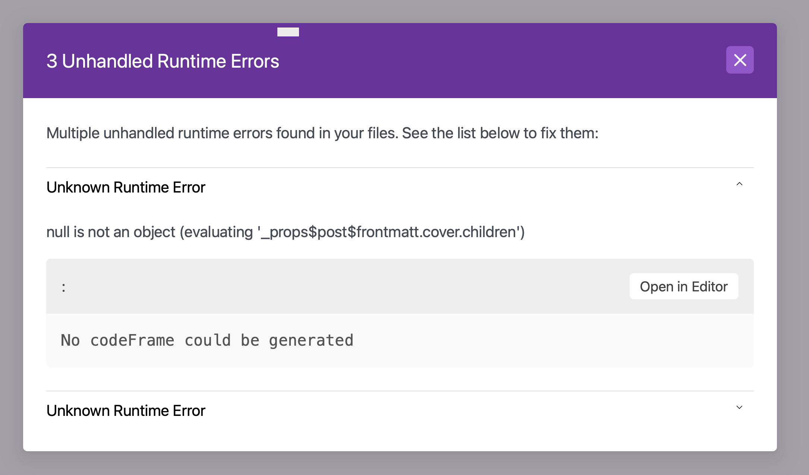

# Holly's skeleton blog

This blog is a [GatsbyJS](https://www.gatsbyjs.org/) blog, based on the [HeroBlog starter](https://github.com/greglobinski/gatsby-starter-hero-blog?tab=readme-ov-file). This code is still a starter, intended to be populated with content.
You can see the skeleton code running at [gatsby-platform.hollycummins.com](http://gatsby-platform.hollycummins.com).

## Initial setup

This codebase should run with Node v14, and a back-level gatsby cli.

```
nvm use 14
npm install -g gatsby-cli@2
npm install
./scripts/preprocess-publications.js
```

## Development

For local development

```text
gatsby develop
```

to hot-serve your website on http://localhost:8000 or

```text
gatsby build
```

to create static site ready to host (/public).

To run unit tests, use

```text
npm run test
```

Integration tests need the site to have been built first (and note that `develop` will un-build it)

```text
gatsby build
npm run test:int
```

### Adding content

The sample content lives in `./content`. This content location is awkward for using this repo as
an upstream framework, so user content would normally live in `../content`, outside this hierarchy.
As soon as a `../content` has been created it will be used as the source of content.

Blog posts live in `content/posts`.
To add an external publication, use `./scripts/add-pub.js [url]` and then fix up the generated content in `content/publications`. You will almost certainly have to update the date in the directory name. Once you've created the markdown, run `./scripts/preprocess-publications.js` to download cover images for local development. To add an external talk, use `./scripts/add-talk.js [slides] [video]` and then fix up the generated content in `content/posts`. Some content will be filled in from the oembed data by a plugin.

If downloading a fresh copy of the source, run `./scripts/preprocess-publications.js` to download gitignored cover images for local development.

To move something from draft to published, add a `yyyy-mm-dd` date prefix to the directory name.

To change the favicon, after replacing the files in `src/images/app-icons` you need to run npm run `generate-app-icons` and then copy the `static/icons/favicon-16x16.png` to `static/favicon.ico`.

You will also need to update `static/CNAME` with a good value for your repo.

### What are all the things?

- xxTemplate: used in generation to make components
- Page: A page with content (headline and body text)
- Article: Wrapped around pages, posts, and categories. Mysterious.
- Blog: The component on the front page with the unordered list and all the Items.
- Item: An entry on the front page.
- Post: A blog entry hosted on this site.
- Publication: A blog entry hosted elsewhere. Include a sentence or two in the markdown for the excerpt.
- Slug: The unique part of a page URL. The important feature is that it contains the title of the article, which helps with SEO.

### Git incantations

To use this as part of a different project (so that updates can be pulled in with low merge-angst), make a new git project which contains a
`content` folder. At the project root, run

```
git remote add platform git@github.com:holly-cummins/gatsby-platform.git
git subtree add --prefix platform platform main
```

To update with new platform changes, run
```
git fetch platform
git subtree pull --prefix platform platform main
git push
```

A merge commit will be generated.

The `.github/workdlows/build_and_publish.yml` will need to be manually copied to the new project root, and
a working directory added.

```
defaults:
  run:
    working-directory: platform
```

### Debugging and trouble shooting

http://localhost:8000/___graphql is useful for inspecting graphql results.

#### Missing cover children

If you get `Multiple unhandled runtime errors found in your files. See the list below to fix them:`, run ./scripts/preprocess-publications.js`



The same issue can also cause `WebpackError: TypeError: Cannot read property 'children' of null` on `gatsby build`.

##### External services

The starter uses external services for some functions: comments, searching, analytics. To use them you have to secure some access data. All services are free to use or have generous free tiers big enough for a personal blog.

Create an `.env` file like below in the root folder. Change `...` placeholders with real data.
<br />By default, your `.env` file will be ignored by git. Remove `.env` from `.gitignore` in order to be able to push the file to your repository.

```text
CLICKY_ID=...
ALGOLIA_APP_ID=...
ALGOLIA_SEARCH_ONLY_API_KEY=...
ALGOLIA_ADMIN_API_KEY=...
ALGOLIA_INDEX_NAME=...
```

### Instructions & tutorials

- [How to install, setup and add new content to a Blog starter](https://dev.greglobinski.com/install-blog-starter/)
- [Setup Algolia account for your GatsbyJS blog](https://dev.greglobinski.com/setup-algolia-account/)
- More articles at [Front-end web development with Greg](https://dev.greglobinski.com/)

## Authors

- Content: Holly Cummins
- Original starter: Greg Lobinski [@greglobinski](https://github.com/greglobinski)

See also the list of [contributors](https://github.com/greglobinski/gatsby-starter-personal-blog/graphs/contributors) who participated in this project.

## Licence

###

Copyright © 2020 Holly Cummins. The source code in articles is freely reusable.

### Original starter:

MIT License

Copyright (c) 2017 gatsbyjs <br />Copyright (c) 2018 greg lobinski

Permission is hereby granted, free of charge, to any person obtaining a copy of this software and associated documentation files (the "Software"), to deal in the Software without restriction, including without limitation the rights to use, copy, modify, merge, publish, distribute, sublicense, and/or sell
copies of the Software, and to permit persons to whom the Software is furnished to do so, subject to the following conditions:

The above copyright notice and this permission notice shall be included in all copies or substantial portions of the Software.

THE SOFTWARE IS PROVIDED "AS IS", WITHOUT WARRANTY OF ANY KIND, EXPRESS OR IMPLIED, INCLUDING BUT NOT LIMITED TO THE WARRANTIES OF MERCHANTABILITY, FITNESS FOR A PARTICULAR PURPOSE AND NONINFRINGEMENT. IN NO EVENT SHALL THE AUTHORS OR COPYRIGHT HOLDERS BE LIABLE FOR ANY CLAIM, DAMAGES OR OTHER LIABILITY, WHETHER IN AN ACTION OF CONTRACT, TORT OR OTHERWISE, ARISING FROM, OUT OF OR IN CONNECTION WITH THE SOFTWARE OR THE USE OR OTHER DEALINGS IN THE SOFTWARE.
