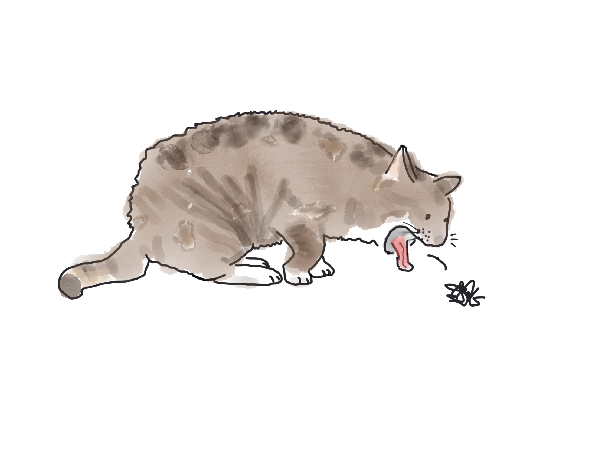

Articles can be committed without turning up in the feed. If they do not have a date in the folder name they will not turn up.
During local development, all articles show.



Here is some code:

```java
 private static void writeQrCode(String text, String imagePath, String outPath, int width) throws Exception {

        Map<EncodeHintType, ErrorCorrectionLevel> hints = new HashMap<>();
```
